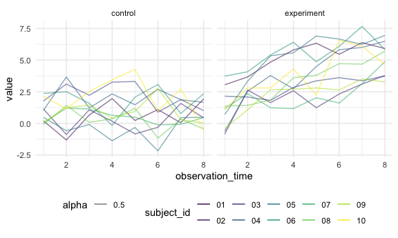
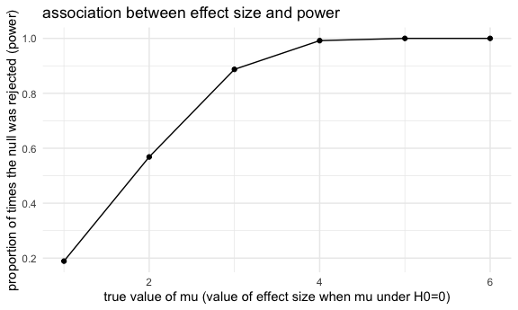

p8105_hw5_sp4170
================
Shihui Peng
2023-11-15

load package and set seed for reproducibility

# problem 2

## data import

``` r
file_import_df = 
  tibble(
    file_name = list.files(path = 'data/'),
    path = str_c('data/', file_name)
  ) |> 
  mutate(
    data = map(path, read_csv)
  ) |> 
  unnest(data)
```

    ## Rows: 1 Columns: 8
    ## ── Column specification ────────────────────────────────────────────────────────
    ## Delimiter: ","
    ## dbl (8): week_1, week_2, week_3, week_4, week_5, week_6, week_7, week_8
    ## 
    ## ℹ Use `spec()` to retrieve the full column specification for this data.
    ## ℹ Specify the column types or set `show_col_types = FALSE` to quiet this message.
    ## Rows: 1 Columns: 8
    ## ── Column specification ────────────────────────────────────────────────────────
    ## Delimiter: ","
    ## dbl (8): week_1, week_2, week_3, week_4, week_5, week_6, week_7, week_8
    ## 
    ## ℹ Use `spec()` to retrieve the full column specification for this data.
    ## ℹ Specify the column types or set `show_col_types = FALSE` to quiet this message.
    ## Rows: 1 Columns: 8
    ## ── Column specification ────────────────────────────────────────────────────────
    ## Delimiter: ","
    ## dbl (8): week_1, week_2, week_3, week_4, week_5, week_6, week_7, week_8
    ## 
    ## ℹ Use `spec()` to retrieve the full column specification for this data.
    ## ℹ Specify the column types or set `show_col_types = FALSE` to quiet this message.
    ## Rows: 1 Columns: 8
    ## ── Column specification ────────────────────────────────────────────────────────
    ## Delimiter: ","
    ## dbl (8): week_1, week_2, week_3, week_4, week_5, week_6, week_7, week_8
    ## 
    ## ℹ Use `spec()` to retrieve the full column specification for this data.
    ## ℹ Specify the column types or set `show_col_types = FALSE` to quiet this message.
    ## Rows: 1 Columns: 8
    ## ── Column specification ────────────────────────────────────────────────────────
    ## Delimiter: ","
    ## dbl (8): week_1, week_2, week_3, week_4, week_5, week_6, week_7, week_8
    ## 
    ## ℹ Use `spec()` to retrieve the full column specification for this data.
    ## ℹ Specify the column types or set `show_col_types = FALSE` to quiet this message.
    ## Rows: 1 Columns: 8
    ## ── Column specification ────────────────────────────────────────────────────────
    ## Delimiter: ","
    ## dbl (8): week_1, week_2, week_3, week_4, week_5, week_6, week_7, week_8
    ## 
    ## ℹ Use `spec()` to retrieve the full column specification for this data.
    ## ℹ Specify the column types or set `show_col_types = FALSE` to quiet this message.
    ## Rows: 1 Columns: 8
    ## ── Column specification ────────────────────────────────────────────────────────
    ## Delimiter: ","
    ## dbl (8): week_1, week_2, week_3, week_4, week_5, week_6, week_7, week_8
    ## 
    ## ℹ Use `spec()` to retrieve the full column specification for this data.
    ## ℹ Specify the column types or set `show_col_types = FALSE` to quiet this message.
    ## Rows: 1 Columns: 8
    ## ── Column specification ────────────────────────────────────────────────────────
    ## Delimiter: ","
    ## dbl (8): week_1, week_2, week_3, week_4, week_5, week_6, week_7, week_8
    ## 
    ## ℹ Use `spec()` to retrieve the full column specification for this data.
    ## ℹ Specify the column types or set `show_col_types = FALSE` to quiet this message.
    ## Rows: 1 Columns: 8
    ## ── Column specification ────────────────────────────────────────────────────────
    ## Delimiter: ","
    ## dbl (8): week_1, week_2, week_3, week_4, week_5, week_6, week_7, week_8
    ## 
    ## ℹ Use `spec()` to retrieve the full column specification for this data.
    ## ℹ Specify the column types or set `show_col_types = FALSE` to quiet this message.
    ## Rows: 1 Columns: 8
    ## ── Column specification ────────────────────────────────────────────────────────
    ## Delimiter: ","
    ## dbl (8): week_1, week_2, week_3, week_4, week_5, week_6, week_7, week_8
    ## 
    ## ℹ Use `spec()` to retrieve the full column specification for this data.
    ## ℹ Specify the column types or set `show_col_types = FALSE` to quiet this message.
    ## Rows: 1 Columns: 8
    ## ── Column specification ────────────────────────────────────────────────────────
    ## Delimiter: ","
    ## dbl (8): week_1, week_2, week_3, week_4, week_5, week_6, week_7, week_8
    ## 
    ## ℹ Use `spec()` to retrieve the full column specification for this data.
    ## ℹ Specify the column types or set `show_col_types = FALSE` to quiet this message.
    ## Rows: 1 Columns: 8
    ## ── Column specification ────────────────────────────────────────────────────────
    ## Delimiter: ","
    ## dbl (8): week_1, week_2, week_3, week_4, week_5, week_6, week_7, week_8
    ## 
    ## ℹ Use `spec()` to retrieve the full column specification for this data.
    ## ℹ Specify the column types or set `show_col_types = FALSE` to quiet this message.
    ## Rows: 1 Columns: 8
    ## ── Column specification ────────────────────────────────────────────────────────
    ## Delimiter: ","
    ## dbl (8): week_1, week_2, week_3, week_4, week_5, week_6, week_7, week_8
    ## 
    ## ℹ Use `spec()` to retrieve the full column specification for this data.
    ## ℹ Specify the column types or set `show_col_types = FALSE` to quiet this message.
    ## Rows: 1 Columns: 8
    ## ── Column specification ────────────────────────────────────────────────────────
    ## Delimiter: ","
    ## dbl (8): week_1, week_2, week_3, week_4, week_5, week_6, week_7, week_8
    ## 
    ## ℹ Use `spec()` to retrieve the full column specification for this data.
    ## ℹ Specify the column types or set `show_col_types = FALSE` to quiet this message.
    ## Rows: 1 Columns: 8
    ## ── Column specification ────────────────────────────────────────────────────────
    ## Delimiter: ","
    ## dbl (8): week_1, week_2, week_3, week_4, week_5, week_6, week_7, week_8
    ## 
    ## ℹ Use `spec()` to retrieve the full column specification for this data.
    ## ℹ Specify the column types or set `show_col_types = FALSE` to quiet this message.
    ## Rows: 1 Columns: 8
    ## ── Column specification ────────────────────────────────────────────────────────
    ## Delimiter: ","
    ## dbl (8): week_1, week_2, week_3, week_4, week_5, week_6, week_7, week_8
    ## 
    ## ℹ Use `spec()` to retrieve the full column specification for this data.
    ## ℹ Specify the column types or set `show_col_types = FALSE` to quiet this message.
    ## Rows: 1 Columns: 8
    ## ── Column specification ────────────────────────────────────────────────────────
    ## Delimiter: ","
    ## dbl (8): week_1, week_2, week_3, week_4, week_5, week_6, week_7, week_8
    ## 
    ## ℹ Use `spec()` to retrieve the full column specification for this data.
    ## ℹ Specify the column types or set `show_col_types = FALSE` to quiet this message.
    ## Rows: 1 Columns: 8
    ## ── Column specification ────────────────────────────────────────────────────────
    ## Delimiter: ","
    ## dbl (8): week_1, week_2, week_3, week_4, week_5, week_6, week_7, week_8
    ## 
    ## ℹ Use `spec()` to retrieve the full column specification for this data.
    ## ℹ Specify the column types or set `show_col_types = FALSE` to quiet this message.
    ## Rows: 1 Columns: 8
    ## ── Column specification ────────────────────────────────────────────────────────
    ## Delimiter: ","
    ## dbl (8): week_1, week_2, week_3, week_4, week_5, week_6, week_7, week_8
    ## 
    ## ℹ Use `spec()` to retrieve the full column specification for this data.
    ## ℹ Specify the column types or set `show_col_types = FALSE` to quiet this message.
    ## Rows: 1 Columns: 8
    ## ── Column specification ────────────────────────────────────────────────────────
    ## Delimiter: ","
    ## dbl (8): week_1, week_2, week_3, week_4, week_5, week_6, week_7, week_8
    ## 
    ## ℹ Use `spec()` to retrieve the full column specification for this data.
    ## ℹ Specify the column types or set `show_col_types = FALSE` to quiet this message.

- i create a df named ‘file_import_df’, make a tibble consisted of every
  file’s name and their relative path. i use `mutate()` to create a new
  variable ‘data’, which contain every csv file i imported using `map()`
  function. I use `unnest()` to unnest contents of each cell of variable
  data.

## data tidy

``` r
file_tidy_df = 
  file_import_df |> 
  janitor::clean_names() |> 
  separate(file_name, c('arm', 'subject_id'), sep = '\\_') |> 
  select(-path) |> 
  mutate(
    subject_id = str_remove(subject_id, '\\.csv'),
    arm = ifelse(arm == 'con', 'control', 'experiment')
  ) |> 
  pivot_longer(
    week_1 : week_8,
    names_to = 'observation_time',
    values_to = 'value',
    names_prefix = 'week_'
  ) |> 
  mutate(
    observation_time = as.numeric(observation_time)
  )
```

- i tidy the result:
  - i use `separate()` to create variable ‘arm’ and ‘subject_id’. i
    remove column ‘path’ as it is not needed. i mutate variable
    subject_id by deleting the suffix and variable arm by renaming ‘con’
    as ‘control’ and ‘exp’ as ‘experience’. I tidy cols week_1 to week_8
    and create col ‘observation_time’ indicating weeks for each
    observation time point and col ‘value’ for each value. i change the
    data type of variable observation_time from character type to
    numeric type.

## make a plot

``` r
file_tidy_df |> 
  ggplot(aes(x = observation_time, y = value, color = subject_id, alpha = 0.5)) +
  geom_line() +
  facet_grid(. ~ arm)
```



- i make a spaghetti plot
- comment
  - the values of subjects in experiment arm suppress the values of
    subjects in control arm in the last observation time. in the
    baseline (the first observation time), both arms had similar value,
    while the spread of baseline value in experiment arm was larger than
    the spread in the control arm
  - the values of subjects in control arm across observation time did
    not change appreciably. but the values of subjects in experiment arm
    across observation time had an increase trend in general.

# problem 3

## create a function

``` r
sim_ttest = function(n_obs = 30, mu, sigma = 5){
  result_df = tibble(
      x_vec = rnorm(n = n_obs, mean = mu, sd = sigma)
  )
  
  result_df |> 
    summarise(
      mu_hat = t.test(x_vec, conf.level = 0.95) |> 
        broom::tidy()|> 
        pull(estimate),
      p_value = t.test(x_vec, conf.level = 0.95) |> 
        broom::tidy()|> 
        pull(p.value)
    ) 
}
```

- i create a function:
  - create a data frame of normally distributed data (set n=30 and
    sigma(sd)=5).
  - save mu_hat and the p-value arising from a test of H:μ=0 using
    α=0.05 with this data frame.

## generate datasets and repeat diff mu

``` r
output = vector('list', length = 5000)

for (i in 1:5000){
  output[[i]] = sim_ttest(mu = 0)
}

bind_rows(output)
```

    ## # A tibble: 5,000 × 2
    ##    mu_hat p_value
    ##     <dbl>   <dbl>
    ##  1  0.412  0.629 
    ##  2  0.664  0.368 
    ##  3  0.551  0.534 
    ##  4  0.567  0.487 
    ##  5 -1.65   0.0599
    ##  6  1.19   0.229 
    ##  7  0.334  0.738 
    ##  8 -1.19   0.209 
    ##  9  0.122  0.887 
    ## 10  0.684  0.472 
    ## # ℹ 4,990 more rows

``` r
sim_result_df = 
  tibble(
    mu = c(1,2,3,4,5,6)
  ) |> 
  mutate(
    output_list_mu = map(mu, ~rerun(5000, sim_ttest(mu = .x))),
    estimate_pvalue_df = map(output_list_mu, bind_rows)
  ) |> 
  unnest(estimate_pvalue_df) |> 
  select(-output_list_mu)
```

    ## Warning: There was 1 warning in `mutate()`.
    ## ℹ In argument: `output_list_mu = map(mu, ~rerun(5000, sim_ttest(mu = .x)))`.
    ## Caused by warning:
    ## ! `rerun()` was deprecated in purrr 1.0.0.
    ## ℹ Please use `map()` instead.
    ##   # Previously
    ##   rerun(5000, sim_ttest(mu = .x))
    ## 
    ##   # Now
    ##   map(1:5000, ~ sim_ttest(mu = .x))

- i generate 5000 datasets from the model. set mu = 0. and i bind the
  results of estimates and p-values of t-tests
- i repeat the above for μ={1,2,3,4,5,6}
  - i first create a df for mu values
  - i create a list containing ttest results (mu_hat and p-values) for
    each mu value which reran by 5000 times, then i bind these results
    for each mu
  - i unnest the mu_hat and p-value dataframe and remove unnecessary
    cols

## making plots

### plot 1: showing the proportion of times the null was rejected (the power of the test) on the y-axis and the true value of μ on the x-axis

``` r
prop_reject_plot =
  sim_result_df |>
  mutate(
    ht_conclusion = ifelse(p_value < 0.05, 'reject H0', 'fail to reject H0')
  ) |> 
  group_by(mu) |> 
  summarise(
    n_total = n(),
    n_rejected_null = sum(ht_conclusion == 'reject H0')
  ) |> 
  mutate(
    prop_reject = n_rejected_null / n_total
  ) |> 
  ggplot(aes(x = mu, y = prop_reject)) +
  geom_point() +
  geom_line() +
  labs(
    x = 'true value of mu (value of effect size when mu under H0=0)',
    y = 'proportion of times the null was rejected (power)',
    title = 'association between effect size and power'
  )

prop_reject_plot
```



``` r
ggsave('plot/association between effect size and power.pdf', prop_reject_plot)
```

    ## Saving 6 x 3.6 in image

- i create a new variable ht_conclusion, indicating the conclusion of
  the hypothesis test
- i calculate \# of total tests and \# of tests that reject H0, and then
  calculate the proportion of reject H0.
- i draw a plot with true value of mu on x-axis and proportion of times
  the null was rejected on y=axis. i save this plot into a folder
  ‘plot’.
- description:
  - when the effect size increase, power will also increase. (mu under
    null hypothesis is 0, so the values in x-axis equal effect size). In
    this case, power increases rapidly from about 0.2 at the beginning
    when effect size increase, and when effect size comes to 5 and 6,
    the power becomes appreciably close to 1.
  - this increasing trend is not linear. power increases approximately
    linearly and rapid at the beginning, and the increase speed slow
    down when effect size = 3, and then the line becomes close to flat
    when effect size = 5. this indicates that power will increase when
    effect size increases, but the speed of this increase will slow
    down.
