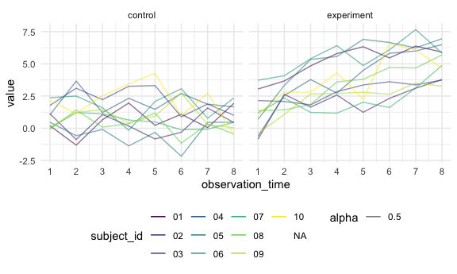
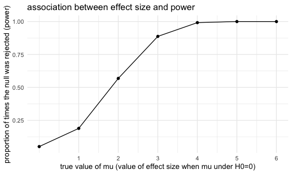
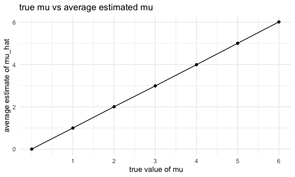

p8105_hw5_sp4170
================
Shihui Peng
2023-11-15

load package and set seed for reproducibility

# problem 1

Read in the data.

``` r
homicide_df = 
  read_csv("data/homicide-data.csv") %>% 
  mutate(
    city_state = str_c(city, state, sep = "_"),
    resolved = case_when(
      disposition == "Closed without arrest" ~ "unsolved",
      disposition == "Open/No arrest"        ~ "unsolved",
      disposition == "Closed by arrest"      ~ "solved",
    )
  ) %>% 
  select(city_state, resolved) %>% 
  filter(city_state != "Tulsa_AL")
```

    ## Rows: 52179 Columns: 12
    ## ── Column specification ────────────────────────────────────────────────────────
    ## Delimiter: ","
    ## chr (9): uid, victim_last, victim_first, victim_race, victim_age, victim_sex...
    ## dbl (3): reported_date, lat, lon
    ## 
    ## ℹ Use `spec()` to retrieve the full column specification for this data.
    ## ℹ Specify the column types or set `show_col_types = FALSE` to quiet this message.

Let’s look at this a bit

``` r
aggregate_df = 
  homicide_df %>% 
  group_by(city_state) %>% 
  summarize(
    hom_total = n(),
    hom_unsolved = sum(resolved == "unsolved")
  )
```

Can I do a prop test for a single city?

``` r
prop.test(
  aggregate_df %>% filter(city_state == "Baltimore_MD") %>% pull(hom_unsolved), 
  aggregate_df %>% filter(city_state == "Baltimore_MD") %>% pull(hom_total)) %>% 
  broom::tidy()
```

    ## # A tibble: 1 × 8
    ##   estimate statistic  p.value parameter conf.low conf.high method    alternative
    ##      <dbl>     <dbl>    <dbl>     <int>    <dbl>     <dbl> <chr>     <chr>      
    ## 1    0.646      239. 6.46e-54         1    0.628     0.663 1-sample… two.sided

Try to iterate ……..

``` r
results_df = 
  aggregate_df %>% 
  mutate(
    prop_tests = map2(.x = hom_unsolved, .y = hom_total, ~prop.test(x = .x, n = .y)),
    tidy_tests = map(.x = prop_tests, ~broom::tidy(.x))
  ) %>% 
  select(-prop_tests) %>% 
  unnest(tidy_tests) %>% 
  select(city_state, estimate, conf.low, conf.high)
```

``` r
results_df %>% 
  mutate(city_state = fct_reorder(city_state, estimate)) %>% 
  ggplot(aes(x = city_state, y = estimate)) +
  geom_point() + 
  geom_errorbar(aes(ymin = conf.low, ymax = conf.high)) + 
  theme(axis.text.x = element_text(angle = 90, vjust = 0.5, hjust = 1))
```


``` r
city_prop_test = function(df) {
  
  n_unsovled ...
  n_total ... 
  
  prop.test(.....)
  
}

homicide_df = 
  read_csv("data/homicide-data.csv") %>% 
  mutate(
    city_state = str_c(city, state, sep = "_"),
    resolved = case_when(
      disposition == "Closed without arrest" ~ "unsolved",
      disposition == "Open/No arrest"        ~ "unsolved",
      disposition == "Closed by arrest"      ~ "solved",
    )
  ) %>% 
  select(city_state, resolved) %>% 
  filter(city_state != "Tulsa_AL") %>% 
  nest(data = resolved)
```

    ## Error: <text>:3:14: unexpected symbol
    ## 2:   
    ## 3:   n_unsovled ...
    ##                 ^

# problem 2

## data import

``` r
file_import_df = 
  tibble(
    file_name = list.files(path = 'data/'),
    path = str_c('data/', file_name)
  ) |> 
  mutate(
    data = map(path, read_csv)
  ) |> 
  unnest(data)
```

    ## Rows: 1 Columns: 8
    ## ── Column specification ────────────────────────────────────────────────────────
    ## Delimiter: ","
    ## dbl (8): week_1, week_2, week_3, week_4, week_5, week_6, week_7, week_8
    ## 
    ## ℹ Use `spec()` to retrieve the full column specification for this data.
    ## ℹ Specify the column types or set `show_col_types = FALSE` to quiet this message.
    ## Rows: 1 Columns: 8
    ## ── Column specification ────────────────────────────────────────────────────────
    ## Delimiter: ","
    ## dbl (8): week_1, week_2, week_3, week_4, week_5, week_6, week_7, week_8
    ## 
    ## ℹ Use `spec()` to retrieve the full column specification for this data.
    ## ℹ Specify the column types or set `show_col_types = FALSE` to quiet this message.
    ## Rows: 1 Columns: 8
    ## ── Column specification ────────────────────────────────────────────────────────
    ## Delimiter: ","
    ## dbl (8): week_1, week_2, week_3, week_4, week_5, week_6, week_7, week_8
    ## 
    ## ℹ Use `spec()` to retrieve the full column specification for this data.
    ## ℹ Specify the column types or set `show_col_types = FALSE` to quiet this message.
    ## Rows: 1 Columns: 8
    ## ── Column specification ────────────────────────────────────────────────────────
    ## Delimiter: ","
    ## dbl (8): week_1, week_2, week_3, week_4, week_5, week_6, week_7, week_8
    ## 
    ## ℹ Use `spec()` to retrieve the full column specification for this data.
    ## ℹ Specify the column types or set `show_col_types = FALSE` to quiet this message.
    ## Rows: 1 Columns: 8
    ## ── Column specification ────────────────────────────────────────────────────────
    ## Delimiter: ","
    ## dbl (8): week_1, week_2, week_3, week_4, week_5, week_6, week_7, week_8
    ## 
    ## ℹ Use `spec()` to retrieve the full column specification for this data.
    ## ℹ Specify the column types or set `show_col_types = FALSE` to quiet this message.
    ## Rows: 1 Columns: 8
    ## ── Column specification ────────────────────────────────────────────────────────
    ## Delimiter: ","
    ## dbl (8): week_1, week_2, week_3, week_4, week_5, week_6, week_7, week_8
    ## 
    ## ℹ Use `spec()` to retrieve the full column specification for this data.
    ## ℹ Specify the column types or set `show_col_types = FALSE` to quiet this message.
    ## Rows: 1 Columns: 8
    ## ── Column specification ────────────────────────────────────────────────────────
    ## Delimiter: ","
    ## dbl (8): week_1, week_2, week_3, week_4, week_5, week_6, week_7, week_8
    ## 
    ## ℹ Use `spec()` to retrieve the full column specification for this data.
    ## ℹ Specify the column types or set `show_col_types = FALSE` to quiet this message.
    ## Rows: 1 Columns: 8
    ## ── Column specification ────────────────────────────────────────────────────────
    ## Delimiter: ","
    ## dbl (8): week_1, week_2, week_3, week_4, week_5, week_6, week_7, week_8
    ## 
    ## ℹ Use `spec()` to retrieve the full column specification for this data.
    ## ℹ Specify the column types or set `show_col_types = FALSE` to quiet this message.
    ## Rows: 1 Columns: 8
    ## ── Column specification ────────────────────────────────────────────────────────
    ## Delimiter: ","
    ## dbl (8): week_1, week_2, week_3, week_4, week_5, week_6, week_7, week_8
    ## 
    ## ℹ Use `spec()` to retrieve the full column specification for this data.
    ## ℹ Specify the column types or set `show_col_types = FALSE` to quiet this message.
    ## Rows: 1 Columns: 8
    ## ── Column specification ────────────────────────────────────────────────────────
    ## Delimiter: ","
    ## dbl (8): week_1, week_2, week_3, week_4, week_5, week_6, week_7, week_8
    ## 
    ## ℹ Use `spec()` to retrieve the full column specification for this data.
    ## ℹ Specify the column types or set `show_col_types = FALSE` to quiet this message.
    ## Rows: 1 Columns: 8
    ## ── Column specification ────────────────────────────────────────────────────────
    ## Delimiter: ","
    ## dbl (8): week_1, week_2, week_3, week_4, week_5, week_6, week_7, week_8
    ## 
    ## ℹ Use `spec()` to retrieve the full column specification for this data.
    ## ℹ Specify the column types or set `show_col_types = FALSE` to quiet this message.
    ## Rows: 1 Columns: 8
    ## ── Column specification ────────────────────────────────────────────────────────
    ## Delimiter: ","
    ## dbl (8): week_1, week_2, week_3, week_4, week_5, week_6, week_7, week_8
    ## 
    ## ℹ Use `spec()` to retrieve the full column specification for this data.
    ## ℹ Specify the column types or set `show_col_types = FALSE` to quiet this message.
    ## Rows: 1 Columns: 8
    ## ── Column specification ────────────────────────────────────────────────────────
    ## Delimiter: ","
    ## dbl (8): week_1, week_2, week_3, week_4, week_5, week_6, week_7, week_8
    ## 
    ## ℹ Use `spec()` to retrieve the full column specification for this data.
    ## ℹ Specify the column types or set `show_col_types = FALSE` to quiet this message.
    ## Rows: 1 Columns: 8
    ## ── Column specification ────────────────────────────────────────────────────────
    ## Delimiter: ","
    ## dbl (8): week_1, week_2, week_3, week_4, week_5, week_6, week_7, week_8
    ## 
    ## ℹ Use `spec()` to retrieve the full column specification for this data.
    ## ℹ Specify the column types or set `show_col_types = FALSE` to quiet this message.
    ## Rows: 1 Columns: 8
    ## ── Column specification ────────────────────────────────────────────────────────
    ## Delimiter: ","
    ## dbl (8): week_1, week_2, week_3, week_4, week_5, week_6, week_7, week_8
    ## 
    ## ℹ Use `spec()` to retrieve the full column specification for this data.
    ## ℹ Specify the column types or set `show_col_types = FALSE` to quiet this message.
    ## Rows: 1 Columns: 8
    ## ── Column specification ────────────────────────────────────────────────────────
    ## Delimiter: ","
    ## dbl (8): week_1, week_2, week_3, week_4, week_5, week_6, week_7, week_8
    ## 
    ## ℹ Use `spec()` to retrieve the full column specification for this data.
    ## ℹ Specify the column types or set `show_col_types = FALSE` to quiet this message.
    ## Rows: 1 Columns: 8
    ## ── Column specification ────────────────────────────────────────────────────────
    ## Delimiter: ","
    ## dbl (8): week_1, week_2, week_3, week_4, week_5, week_6, week_7, week_8
    ## 
    ## ℹ Use `spec()` to retrieve the full column specification for this data.
    ## ℹ Specify the column types or set `show_col_types = FALSE` to quiet this message.
    ## Rows: 1 Columns: 8
    ## ── Column specification ────────────────────────────────────────────────────────
    ## Delimiter: ","
    ## dbl (8): week_1, week_2, week_3, week_4, week_5, week_6, week_7, week_8
    ## 
    ## ℹ Use `spec()` to retrieve the full column specification for this data.
    ## ℹ Specify the column types or set `show_col_types = FALSE` to quiet this message.
    ## Rows: 1 Columns: 8
    ## ── Column specification ────────────────────────────────────────────────────────
    ## Delimiter: ","
    ## dbl (8): week_1, week_2, week_3, week_4, week_5, week_6, week_7, week_8
    ## 
    ## ℹ Use `spec()` to retrieve the full column specification for this data.
    ## ℹ Specify the column types or set `show_col_types = FALSE` to quiet this message.
    ## Rows: 1 Columns: 8
    ## ── Column specification ────────────────────────────────────────────────────────
    ## Delimiter: ","
    ## dbl (8): week_1, week_2, week_3, week_4, week_5, week_6, week_7, week_8
    ## 
    ## ℹ Use `spec()` to retrieve the full column specification for this data.
    ## ℹ Specify the column types or set `show_col_types = FALSE` to quiet this message.
    ## Rows: 52179 Columns: 12
    ## ── Column specification ────────────────────────────────────────────────────────
    ## Delimiter: ","
    ## chr (9): uid, victim_last, victim_first, victim_race, victim_age, victim_sex...
    ## dbl (3): reported_date, lat, lon
    ## 
    ## ℹ Use `spec()` to retrieve the full column specification for this data.
    ## ℹ Specify the column types or set `show_col_types = FALSE` to quiet this message.

- i create a df named ‘file_import_df’, make a tibble consisted of every
  file’s name and their relative path. i use `mutate()` to create a new
  variable ‘data’, which contain every csv file i imported using `map()`
  function. I use `unnest()` to unnest contents of each cell of variable
  data.

## data tidy

``` r
file_tidy_df = 
  file_import_df |> 
  janitor::clean_names() |> 
  separate(file_name, c('arm', 'subject_id'), sep = '\\_') |> 
  select(-path) |> 
  mutate(
    subject_id = str_remove(subject_id, '\\.csv'),
    arm = ifelse(arm == 'con', 'control', 'experiment')
  ) |> 
  pivot_longer(
    week_1 : week_8,
    names_to = 'observation_time',
    values_to = 'value',
    names_prefix = 'week_'
  ) |> 
  mutate(
    observation_time = as.numeric(observation_time)
  )
```

    ## Warning: Expected 2 pieces. Missing pieces filled with `NA` in 52179 rows [21, 22, 23,
    ## 24, 25, 26, 27, 28, 29, 30, 31, 32, 33, 34, 35, 36, 37, 38, 39, 40, ...].

- i tidy the result:
  - i use `separate()` to create variable ‘arm’ and ‘subject_id’. i
    remove column ‘path’ as it is not needed. i mutate variable
    subject_id by deleting the suffix and variable arm by renaming ‘con’
    as ‘control’ and ‘exp’ as ‘experience’. I tidy cols week_1 to week_8
    and create col ‘observation_time’ indicating weeks for each
    observation time point and col ‘value’ for each value. i change the
    data type of variable observation_time from character type to
    numeric type.

## make a plot

``` r
con_exp_plot =
file_tidy_df |> 
  ggplot(aes(x = observation_time, y = value, color = subject_id, alpha = 0.5)) +
  geom_line() +
  facet_grid(. ~ arm)

con_exp_plot
```

    ## Warning: Removed 417432 rows containing missing values (`geom_line()`).



``` r
ggsave('plot/observation_over_time_two_arms.pdf', con_exp_plot)
```

    ## Saving 6 x 3.6 in image

    ## Warning: Removed 417432 rows containing missing values (`geom_line()`).

- i make a spaghetti plot
- comment\* the values of subjects in experiment arm suppress the values
  of subjects in control arm in the last observation time. in the
  baseline (the first observation time), both arms had similar value,
  while the spread of baseline value in experiment arm was larger than
  the spread in the control arm
  - the values of subjects in control arm across observation time did
    not change appreciably. but the values of subjects in experiment arm
    across observation time had an increase trend in general.

# problem 3

## create a function

``` r
sim_ttest = function(n_obs = 30, mu, sigma = 5){
  result_df = tibble(
      x_vec = rnorm(n = n_obs, mean = mu, sd = sigma)
  )
  
  result_df |> 
    summarise(
      mu_hat = t.test(x_vec, conf.level = 0.95) |> 
        broom::tidy()|> 
        pull(estimate),
      p_value = t.test(x_vec, conf.level = 0.95) |> 
        broom::tidy()|> 
        pull(p.value)
    ) 
}
```

- i create a function:
  - create a data frame of normally distributed data (set n=30 and
    sigma(sd)=5).
  - save mu_hat and the p-value arising from a test of H:μ=0 using
    α=0.05 with this data frame.

## generate datasets and repeat diff mu

``` r
output = vector('list', length = 5000)

for (i in 1:5000){
  output[[i]] = sim_ttest(mu = 0)
}

bind_rows(output)
```

    ## # A tibble: 5,000 × 2
    ##    mu_hat p_value
    ##     <dbl>   <dbl>
    ##  1  0.412  0.629 
    ##  2  0.664  0.368 
    ##  3  0.551  0.534 
    ##  4  0.567  0.487 
    ##  5 -1.65   0.0599
    ##  6  1.19   0.229 
    ##  7  0.334  0.738 
    ##  8 -1.19   0.209 
    ##  9  0.122  0.887 
    ## 10  0.684  0.472 
    ## # ℹ 4,990 more rows

``` r
sim_result_df = 
  tibble(
    mu = c(1,2,3,4,5,6)
  ) |> 
  mutate(
    output_list_mu = map(mu, ~rerun(5000, sim_ttest(mu = .x))),
    estimate_pvalue_df = map(output_list_mu, bind_rows)
  ) |> 
  unnest(estimate_pvalue_df) |> 
  select(-output_list_mu)
```

    ## Warning: There was 1 warning in `mutate()`.
    ## ℹ In argument: `output_list_mu = map(mu, ~rerun(5000, sim_ttest(mu = .x)))`.
    ## Caused by warning:
    ## ! `rerun()` was deprecated in purrr 1.0.0.
    ## ℹ Please use `map()` instead.
    ##   # Previously
    ##   rerun(5000, sim_ttest(mu = .x))
    ## 
    ##   # Now
    ##   map(1:5000, ~ sim_ttest(mu = .x))

- i generate 5000 datasets from the model. set mu = 0. and i bind the
  results of estimates and p-values of t-tests
- i repeat the above for μ={1,2,3,4,5,6}
  - i first create a df for mu values
  - i create a list containing ttest results (mu_hat and p-values) for
    each mu value which reran by 5000 times, then i bind these results
    for each mu
  - i unnest the mu_hat and p-value dataframe and remove unnecessary
    cols

## making plots

### plot 1: showing the proportion of times the null was rejected (the power of the test) on the y-axis and the true value of μ on the x-axis

``` r
prop_reject_plot =
  sim_result_df |>
  mutate(
    ht_conclusion = ifelse(p_value < 0.05, 'reject H0', 'fail to reject H0')
  ) |> 
  group_by(mu) |> 
  summarise(
    n_total = n(),
    n_rejected_null = sum(ht_conclusion == 'reject H0')
  ) |> 
  mutate(
    prop_reject = n_rejected_null / n_total
  ) |> 
  ggplot(aes(x = mu, y = prop_reject)) +
  geom_point() +
  geom_line() +
  labs(
    x = 'true value of mu (value of effect size when mu under H0=0)',
    y = 'proportion of times the null was rejected (power)',
    title = 'association between effect size and power'
  )

prop_reject_plot
```



``` r
ggsave('plot/association between effect size and power.pdf', prop_reject_plot)
```

    ## Saving 6 x 3.6 in image

- i create a new variable ht_conclusion, indicating the conclusion of
  the hypothesis test
- i calculate \# of total tests and \# of tests that reject H0, and then
  calculate the proportion of reject H0.
- i draw a plot with true value of mu on x-axis and proportion of times
  the null was rejected on y=axis. i save this plot into a folder
  ‘plot’.
- description:
  - when the effect size increase, power will also increase. (mu under
    null hypothesis is 0, so the values in x-axis equal effect size). In
    this case, power increases rapidly from about 0.2 at the beginning
    when effect size increase, and when effect size comes to 5 and 6,
    the power becomes appreciably close to 1.
  - this increasing trend is not linear. power increases approximately
    linearly and rapid at the beginning, and the increase speed slow
    down when effect size = 3, and then the line becomes close to flat
    when effect size = 5. this indicates that power will increase when
    effect size increases, but the speed of this increase will slow
    down.

### plot 2: showing the average estimate of μ̂ on the y axis and the true value of μ on the x axis.

``` r
ave_mu_hat_plot =
  sim_result_df |> 
  group_by(mu) |> 
  summarise(
    mean_mu_hat = mean(mu_hat)
  ) |> 
  ggplot(aes(x = mu, y = mean_mu_hat)) + 
  geom_point() +
  geom_line() +
  labs(
    x = ' true value of mu',
    y = 'average estimate of mu_hat',
    title = 'association between true mu and average estimated mu'
  )

ave_mu_hat_plot
```



``` r
ggsave('plot/avg_mu_hat_and_true_mu.pdf', ave_mu_hat_plot)
```

    ## Saving 6 x 3.6 in image

- i calculate the mean estimated mu for each group of true mu value.
  then i draw a plot show the relationship and make the average estimate
  of μ̂ on the y axis and the true value of μ on the x axis.
- description
  - the true value of mus and the average estimate of mu_hats derived by
    simulations are approximately the same based on the plot.

### plot 3: showing the average estimate of mu only in samples for which the null was rejected on the y axis and the true value of μ on the x axis

``` r
ave_mu_hat_reject_plot =
  sim_result_df |> 
  mutate(
    ht_conclusion = ifelse(p_value < 0.05, 'reject H0', 'fail to reject H0')
  ) |> 
  filter(ht_conclusion == 'reject H0') |> 
  group_by(mu) |> 
  summarise(
    mean_mu_hat = mean(mu_hat)
  ) |> 
  ggplot(aes(x = mu, y = mean_mu_hat)) + 
  geom_point() +
  geom_line() +
  labs(
    x = ' true value of mu',
    y = 'average estimate of mu_hat',
    title = 'association between true mu and average estimated mu'
  )

ave_mu_hat_reject_plot
```


``` r
ggsave('plot/avg_mu_hat_and_true_mu_in_rejectH0.pdf', ave_mu_hat_reject_plot)
```

    ## Saving 6 x 3.6 in image

- i create a variable ht_conclusion indicating the conclusion of
  hypothesis test and filter the data to only keep data which the null
  hypo was rejected.
- i calculate the mean estimated mu for each group of true mu value.
  then i draw a plot show the relationship and make the average estimate
  of μ̂ on the y axis and the true value of μ on the x axis.
- question: Is the sample average of mu across tests for which the null
  is rejected approximately equal to the true value of mu?
  - when true value of mu in 1,2,3, the average estimate of mu_hat is
    not that same as the true value of mu.
  - when the true value of mu in 4,5,6, the average estimate of mu_hat
    is approximately the same as the true value of mu.
- why?
  - 

``` r
sim_result_df |> 
  mutate(
    ht_conclusion = ifelse(p_value < 0.05, 'reject H0', 'fail to reject H0')
  ) |> 
  filter(ht_conclusion == 'reject H0') |> 
  group_by(mu) |> 
  summarise(
    mean_mu_hat = mean(mu_hat)
  ) 
```

    ## # A tibble: 6 × 2
    ##      mu mean_mu_hat
    ##   <dbl>       <dbl>
    ## 1     1        2.21
    ## 2     2        2.60
    ## 3     3        3.18
    ## 4     4        4.01
    ## 5     5        5.01
    ## 6     6        6.02
